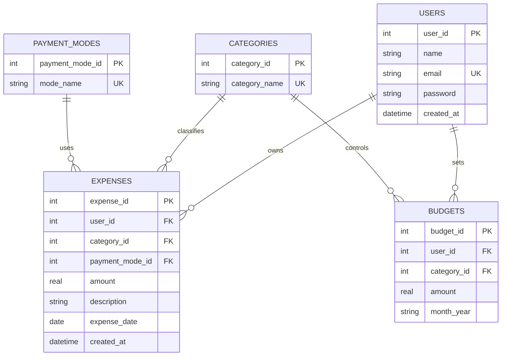

# Expense Analytics & Budget Management System

A beginner-friendly **DBMS Mini Project** built using **Python Flask, SQLite, HTML, CSS and JavaScript**.

The system allows users to manage daily expenses, set monthly budgets, view reports, filter transactions and analyze spending patterns using a simple rule-based risk analysis system.

---

## Features

- User Registration and Login
- Password Hashing using Werkzeug
- Session-based Authentication
- Add, View, Edit and Delete Expenses
- Monthly and Category-wise Budgets
- Master Data Management
- Category and Payment Mode Management
- Combined Expense Search and Filters
- Dashboard with Expense Summary
- Category-wise and Monthly Expense Charts
- Reports and SQL-based Analysis
- CSV Export
- SQL View
- SQL Trigger for Deleted Expense Logging
- User-specific Expenses and Budgets
- Rule-based Spending Risk Analysis
- SQLite Database with Foreign Keys and Constraints

---

## Technology Stack

| Technology | Purpose |
|---|---|
| Python | Backend Programming |
| Flask | Web Application Framework |
| SQLite | Database Management |
| HTML | Page Structure |
| CSS | Styling and Responsive Layout |
| JavaScript | Client-side Functionality |
| Chart.js | Dashboard Charts |
| Werkzeug | Password Hashing |

---

## Project Architecture

```text
User
  ↓
HTML / CSS / JavaScript
  ↓
Flask Application
  ↓
SQLite Database
  ↓
SQL Queries & Aggregation
  ↓
Reports / Dashboard / Analytics
```

---

## Project Structure

```text
expense-analytics/
│
├── static/
│   ├── css/
│   │   └── style.css
│   └── js/
│       └── script.js
│
├── templates/
│   ├── base.html
│   ├── login.html
│   ├── register.html
│   ├── dashboard.html
│   ├── expenses.html
│   ├── add_expense.html
│   ├── edit_expense.html
│   ├── budget.html
│   ├── master_data.html
│   └── reports.html
│
├── app.py
├── database.py
├── analytics.py
├── schema.sql
├── queries.sql
├── mysql_version.sql
├── seed.py
├── reset_db.py
├── requirements.txt
├── expense_analytics.db
├── .gitignore
└── README.md
```

---

## Main Modules

### 1. User Management

- User registration
- Login and logout
- Password hashing
- Session-based authentication
- User-specific data access

### 2. Expense Management

- Add expenses
- View expenses
- Edit expenses
- Delete expenses
- Category and payment mode selection
- Expense date and description

### 3. Budget Management

Users can create monthly category budgets and compare:

- Budget
- Actual Spending
- Remaining Amount
- Budget Utilization

### 4. Master Data Management

The system manages:

- Expense Categories
- Payment Modes

### 5. Search and Filtering

Expenses can be filtered using:

- Category
- Payment Mode
- Start Date
- End Date
- Minimum Amount
- Maximum Amount

### 6. Dashboard

The dashboard provides:

- Total Expenses
- Current Month Expenses
- Monthly Budget
- Remaining Budget
- Budget Utilization
- Highest Spending Category
- Transaction Count
- Recent Transactions

### 7. Reports

The reports module provides SQL-based analysis using:

- SUM
- COUNT
- AVG
- MAX
- MIN
- GROUP BY
- HAVING
- ORDER BY
- JOIN
- Subqueries

CSV export is also available.

### 8. Spending Risk Analysis

The system performs simple rule-based spending analysis and classifies spending risk as:

- LOW
- MEDIUM
- HIGH

This is a rule-based analytics component and not an advanced machine-learning model.

---

## Database Design

The application uses **SQLite** as its live database.

Database file:

```text
expense_analytics.db
```

### Tables

1. `users`
2. `categories`
3. `payment_modes`
4. `expenses`
5. `budgets`
6. `deleted_expense_log`

### Database Constraints

The project uses:

- Primary Keys
- Foreign Keys
- NOT NULL
- UNIQUE
- CHECK Constraints

Foreign-key enforcement is enabled using:

```sql
PRAGMA foreign_keys = ON;
```

---

## ER Diagram



---

## Database Relationships

- One user can have many expenses.
- One user can create many budgets.
- One category can classify many expenses.
- One payment mode can be used for many expenses.
- One category can have many budgets.

Foreign keys maintain the relationships between the tables and help prevent orphan records.

---

## Normalization

The database separates users, categories, payment modes, expenses and budgets into different tables.

For example, category names such as `Food`, `Travel` and `Shopping` are stored in the `categories` table instead of being repeatedly stored in every expense record.

This reduces data redundancy and supports a practical **3NF-style database design**.

---

## SQL and DBMS Concepts

The project demonstrates:

- SELECT
- INSERT
- UPDATE
- DELETE
- WHERE
- ORDER BY
- JOIN
- LEFT JOIN
- Aggregate Functions
- GROUP BY
- HAVING
- Subqueries
- Views
- Triggers
- Primary Keys
- Foreign Keys
- UNIQUE Constraints
- CHECK Constraints

The `queries.sql` file contains **20 example SQL queries** covering different DBMS concepts.

---

## SQL View

The project includes the SQLite view:

```text
monthly_expense_summary
```

The view is used to summarize expense information by month.

---

## SQL Trigger

A database trigger is used to log deleted expense records into:

```text
deleted_expense_log
```

This demonstrates automatic database-level actions using a SQL trigger.

---

## Analytics

The project includes a simple **rule-based Spending Risk Analysis**.

Budget usage is calculated as:

```text
budget_usage = (monthly_expense / monthly_budget) × 100
```

Risk levels:

| Budget Usage | Risk Level |
|---|---|
| Below 50% | LOW |
| 50% to 80% | MEDIUM |
| Above 80% | HIGH |

The system also provides an explanation and suggestion based on the spending level.

> This is a transparent rule-based analytics component and is not an advanced machine-learning model.

---

## Chart Visualization

Dashboard charts are created using **Chart.js**, a JavaScript charting library.

The data flow is:

```text
SQLite
   ↓
Flask / Python
   ↓
SQL Aggregation
   ↓
HTML
   ↓
JavaScript
   ↓
Chart.js
   ↓
Dashboard Charts
```

The dashboard includes category-wise and monthly spending visualization.

---

## MySQL Reference

The live application uses **SQLite**.

The file:

```text
mysql_version.sql
```

is included as an **academic MySQL reference** for demonstrating:

- Database and table creation
- Constraints
- Views
- Triggers
- Stored Procedures
- Functions
- JOIN
- GROUP BY
- HAVING
- Subqueries

The running Flask application does **not** require MySQL.

---

## Run on Windows

### 1. Create Virtual Environment

```powershell
python -m venv venv
```

### 2. Activate Virtual Environment

For PowerShell:

```powershell
.\venv\Scripts\Activate.ps1
```

### 3. Install Dependencies

```powershell
pip install -r requirements.txt
```

### 4. Reset Database

```powershell
python reset_db.py
```

### 5. Add Demo Data

```powershell
python seed.py
```

### 6. Start Flask Application

```powershell
python app.py
```

Open:

```text
http://127.0.0.1:5000
```

---

## Demo Login

```text
Email: demo@example.com
Password: demo123
```

---

## Default Categories

- Food
- Travel
- Shopping
- Bills
- Education
- Health
- Entertainment
- Other

## Default Payment Modes

- Cash
- UPI
- Credit Card
- Debit Card
- Bank Transfer

---

## Security

The project includes:

- Password hashing using Werkzeug
- Session-based authentication
- Protected application routes
- User-specific expense and budget access
- SQLite foreign-key enforcement
- Input validation for expense amounts and required fields

---

## Limitations

- SQLite is intended for a local academic project rather than a multi-server production environment.
- Spending analysis is rule-based.
- The application uses a local development configuration.
- Chart.js is loaded from a CDN when available.

---

## Future Scope

Possible improvements include:

- Machine-learning-based expense forecasting
- Automated budget recommendations
- Spending notifications
- Email or mobile notifications
- Cloud database deployment
- Advanced data visualization
- Mobile application
- Production-grade authentication and security

---

## Academic Purpose

This project was developed as a **DBMS Mini Project** to demonstrate practical implementation of database concepts along with a web-based expense management system.

It combines:

```text
Database Management
        +
Web Development
        +
SQL Analysis
        +
Data Visualization
        +
Rule-Based Analytics
```

---

## License

This project is intended for academic and educational purposes.